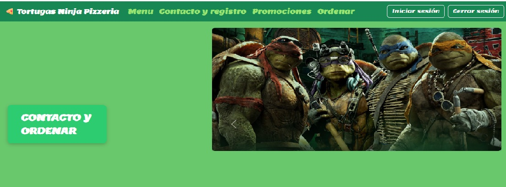
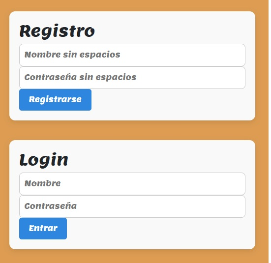
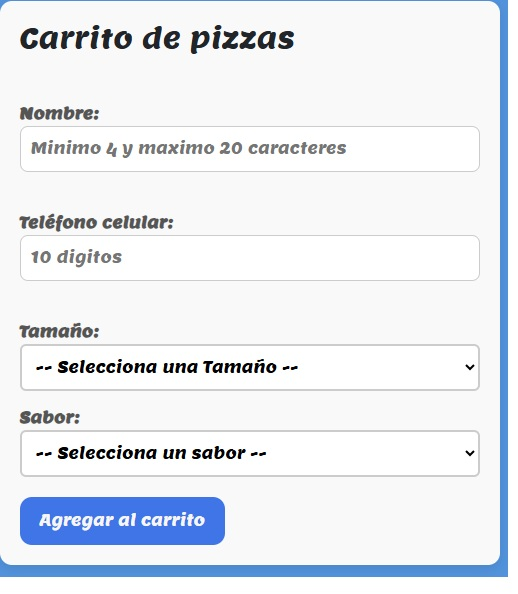

# 🍕 TMNT PIZZA

Aplicación web completa para administrar y ordenar pizzas con carrito, desarrollada con **Node.js**, **Express**, **EJS** y **MySQL**.  
Incluye autenticación, panel de administración, subida de imágenes, control de roles y una experiencia de usuario moderna y responsiva.

> 💡 Proyecto full stack creado para portafolio, destacando autenticación segura, CRUDs protegidos, gestión dinámica de contenido y una UI intuitiva.

---

## 🚀 Características principales

- 🔐 Autenticación con JWT y cookies seguras
- 🧑‍🍳 Panel de administración con edición de menú, usuarios, órdenes, promociones, carrito y edición de órdenes
- 🖼️ Subida de imágenes con **Multer** y eliminación automática de archivos antiguos
- 🎠 Carruseles dinámicos de pizzas, imágenes y menú con **Bootstrap 5**
- 🧾 Notificaciones visuales animadas con CSS
- 🧩 Modularización de rutas y vistas
- 🧠 Control de acceso por roles (**admin / cliente**)
- 📱 Diseño responsive y experiencia de usuario pulida

---

## 🧾 Formularios dinámicos (Ordenar y Editar)

Los formularios de **ordenar** y **editar** incluyen **selects dinámicos** que muestran los sabores disponibles en la base de datos (`tabla pizzas`).

Estos selects se actualizan automáticamente cuando el administrador cambia los sabores desde el **panel de administración (editar menú)**.  
De esta forma, el cliente siempre ve las opciones actualizadas sin necesidad de modificar el código.

---

## 🛠️ Tecnologías utilizadas

- **Backend:** Node.js, Express.js, method-override, bcrypt
- **Frontend:** EJS, Bootstrap 5, CSS personalizado, HTML
- **Base de datos:** MySQL con promesas
- **Autenticación:** JSON Web Tokens (JWT), cookie-parser
- **Subida de archivos:** Multer
- **Gestión de imágenes:** fs, path

---

## 📸 Capturas de pantalla

- 
- 
- 
- 
- 

---

## ⚙️ Instalación rápida

```bash
# 1. Clona el repositorio
git clone https://github.com/donatelo666/web_pizza.git
cd web_pizza

# 2. Instala dependencias
npm install

# 3. Configura tus variables de entorno (.env)
DB_HOST=localhost
DB_USER=root
DB_PASS=tu_password
DB_NAME=pizzeria

# 4. Ejecuta el servidor
npm start


```

Configuracion base de datos
´´´
-- Tabla usuarios
CREATE TABLE usuarios (
id INT AUTO_INCREMENT PRIMARY KEY,
nombre VARCHAR(100) NOT NULL,
password VARCHAR(255) NOT NULL,
rol ENUM('admin', 'cliente') DEFAULT 'cliente'
);

-- Tabla pizzas
CREATE TABLE pizzas (
id INT AUTO_INCREMENT PRIMARY KEY,
nombre VARCHAR(100) NOT NULL,
ingredientes TEXT NOT NULL,
ruta_imagen VARCHAR(255)
);

-- Tabla órdenes
CREATE TABLE ordenes (
id INT AUTO_INCREMENT PRIMARY KEY,
nombre VARCHAR(100),
telefono VARCHAR(20),
tamano VARCHAR(50),
sabor VARCHAR(100),
id_usuario INT
);

-- Tabla promociones
CREATE TABLE promociones (
id INT AUTO_INCREMENT PRIMARY KEY,
titulo VARCHAR(100),
descripcion TEXT
);
´´´

📡 Endpoints principales

Método Ruta Descripción

POST /register Registro de usuario
POST /login Inicio de sesión
GET /ordenes/:id Consultar carrito (protegido)
POST /api/ordenes Crear carrito (protegido)
PUT /ordenes/:id Actualizar pedido (protegido)
DELETE /ordenes/:id Eliminar pedido (protegido)

📦 Dependencias principales

express

mysql2

dotenv

cookie-parser

jsonwebtoken

ejs

multer

bcryptjs

🔐 Seguridad

Contraseñas cifradas con bcrypt

Tokens JWT para autenticación

Middleware para protección de rutas y control de roles

🧪 Pruebas automatizadas

Este proyecto incluye pruebas automatizadas para las funcionalidades principales del backend, implementadas con Jest y Supertest.

🔍 Cobertura de pruebas
🧑‍💻 Registro de usuario

✅ Pasa con datos válidos

❌ Falla correctamente con datos incompletos o inválidos

🔑 Login con JWT y bcrypt

✅ Pasa con credenciales válidas

❌ Falla con credenciales incorrectas o vacías

🍕 Ordenar (carrito de compras)

✅ Pasa con datos completos y token válido

❌ Falla con datos incompletos o sin autenticación

🎯 Estas pruebas garantizan el correcto funcionamiento de las rutas principales del sistema (autenticación, autorización y flujo de pedido) y validan que la API responda adecuadamente tanto en casos exitosos como en escenarios con errores de validación o seguridad.

👨‍💻 Autor

David Sebastian Sandoval
Desarrollador web apasionado por crear aplicaciones dinámicas, seguras y visualmente atractivas.
📫 chopolonsio@hotmail.com
